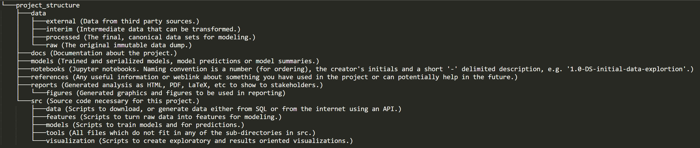

#  Data Science Project Structure

##  Description
This directory contains the project structure for all data science project going forward (14-June-2023). There are several directories in the main directory, each of which contain an info.txt which you can read to understand which files are supposed to go in each directory.

##  Installation
This project doesn't require any installation. Please copy the base directory (project_structure) to the desired location in Github and rename it to the project name.  

##  Usage
Please change all the fields marked in {} in shell script.sh to suit your requirements. The shell script runs the python file setup.py which will in turn run all the necesaty files.

All the source code which is needed for the project needs to go in the src directory. Each sub-direcotry in src also contains an info.txt to understand what needs to go in each directory.